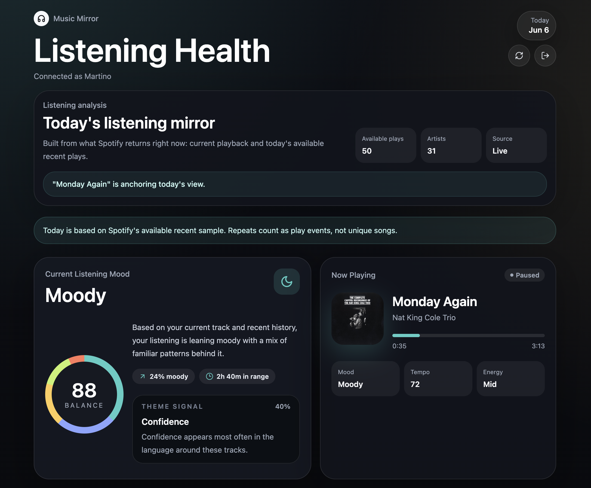
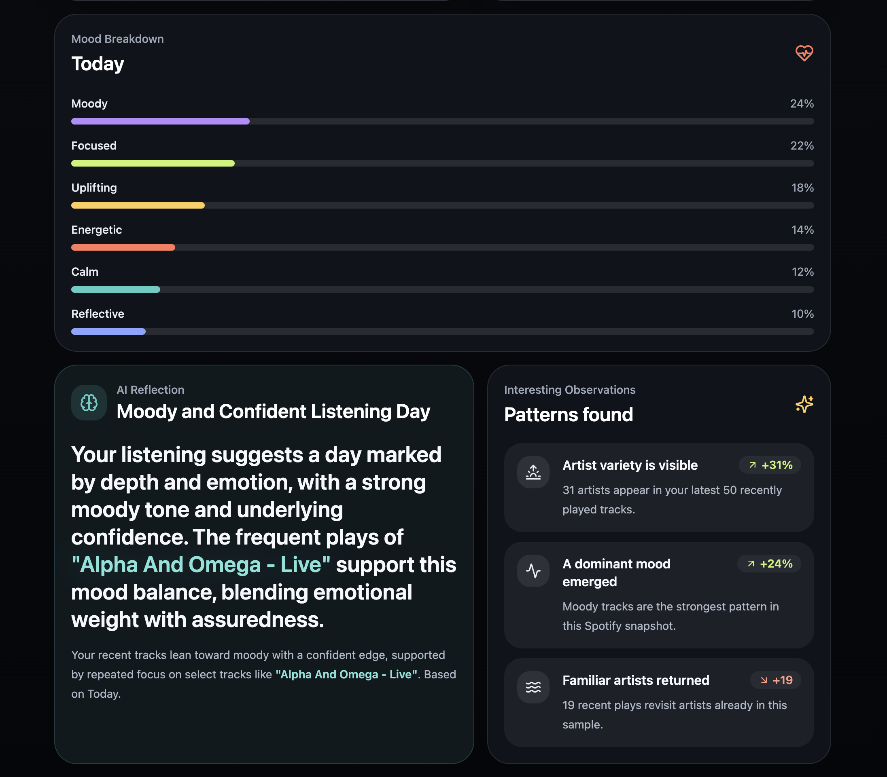

# Music Mirror

Music Mirror is a mobile-first Spotify listening dashboard built with Next.js, TypeScript, and Tailwind CSS.

It is designed to feel closer to WHOOP or Apple Health than a traditional music player. The app focuses on lightweight listening insights, not playback controls.

## Product Preview

Top of dashboard:



Lower dashboard sections:



## What It Does Today

Music Mirror currently shows:

- Spotify account connection status
- currently playing track
- recently played tracks available from Spotify right now
- a current listening mood card
- a mood breakdown for today
- AI-generated reflection copy from the available Spotify sample
- interesting observations from the same sample

This version is intentionally a **today-focused listening mirror**. It does **not** store history in a database.

## Current Product Shape

Right now, the app is best understood as:

- a live Spotify-connected dashboard
- a daily reflection surface
- a private beta / demo when Spotify auth is enabled

It is **not yet** a full historical music analytics platform.

## Why It Focuses On Today

Spotify's Web API does not give this app a guaranteed complete archive of the last week or month. Music Mirror therefore filters the currently available recent sample into **today's** local date window and builds the dashboard from that.

Read the deeper explanation here:

- [Spotify data model and limitations](docs/SPOTIFY_DATA.md)

## Tech Stack

- Next.js App Router
- TypeScript
- Tailwind CSS
- Spotify Web API
- OpenAI Responses API
- Vercel Web Analytics

## Local Setup

Install dependencies:

```bash
npm install
```

Create a local env file:

```bash
cp .env.example .env.local
```

Run the app:

```bash
npm run dev
```

Open:

```txt
http://127.0.0.1:3000
```

## Environment Variables

Required for Spotify:

```txt
NEXT_PUBLIC_SPOTIFY_CLIENT_ID=
```

Optional Spotify redirect override:

```txt
NEXT_PUBLIC_SPOTIFY_REDIRECT_URI=
```

If omitted, the app uses `/callback` on the current origin.

Required for AI reflections:

```txt
OPENAI_API_KEY=
```

Optional OpenAI model override:

```txt
OPENAI_MODEL=
```

If omitted, the current reflection route defaults to `gpt-4.1-mini`.

## Spotify App Setup

In Spotify Developer Dashboard:

1. Create an app
2. Add your callback URL
3. Use these scopes:

```txt
user-read-private
user-read-currently-playing
user-read-playback-state
user-read-recently-played
```

Typical local callback:

```txt
http://127.0.0.1:3000/callback
```

Typical production callback:

```txt
https://your-domain.com/callback
```

## Important Spotify Limitation

Spotify app access is controlled by **Spotify quota mode**, not by whether the app is deployed on Vercel.

If your Spotify app is in **Development Mode**:

- only a limited number of authenticated Spotify users can use it
- users must be allowlisted in Spotify Developer Dashboard
- the app should be treated as a private beta or tester build

So you can have a public website URL while still having a Spotify integration that is effectively private.

If you want broad public adoption, Spotify quota mode becomes the platform constraint.

## AI Reflection Behavior

The app sends the currently playing track plus the available recently played sample to `/api/reflection`.

That route:

- builds a local fallback dashboard first
- asks OpenAI for structured JSON reflection output
- merges AI reflection content back into the dashboard shape
- falls back to local insight generation if OpenAI is unavailable or not configured

The AI layer is used for:

- reflection headline
- reflection body
- mood framing
- observation wording
- theme signal wording

It is **not** used for diagnosis, personality inference, or medical claims.

## Analytics

The app includes Vercel Web Analytics.

It currently tracks:

- page views
- `spotify_connect_clicked`
- `spotify_connected`
- `spotify_disconnect_clicked`
- `dashboard_refreshed`

These are intended for private project analytics in Vercel, not for an in-app public visitor counter.

## Scripts

```bash
npm run dev
npm run build
npm run start
npm run lint
```

## Deployment

Music Mirror is set up to deploy cleanly on Vercel.

For production, make sure you set:

- `NEXT_PUBLIC_SPOTIFY_CLIENT_ID`
- `NEXT_PUBLIC_SPOTIFY_REDIRECT_URI`
- `OPENAI_API_KEY`
- optionally `OPENAI_MODEL`

You should also update the Spotify app's redirect URI list so it exactly matches your deployed callback URL.

## What This Version Does Not Do

This version does not:

- store durable listening history
- reconstruct full weekly or monthly playback history
- expose public Spotify access beyond Spotify's quota rules
- analyze raw Spotify audio streams

## Good Next Steps

If you want Music Mirror to grow beyond a private Spotify beta, the strongest next options are:

1. add a database-backed history layer
2. add a public demo mode that does not require Spotify login
3. keep Spotify sync as a private beta feature

## Documentation

- [Spotify data model and limitations](docs/SPOTIFY_DATA.md)
